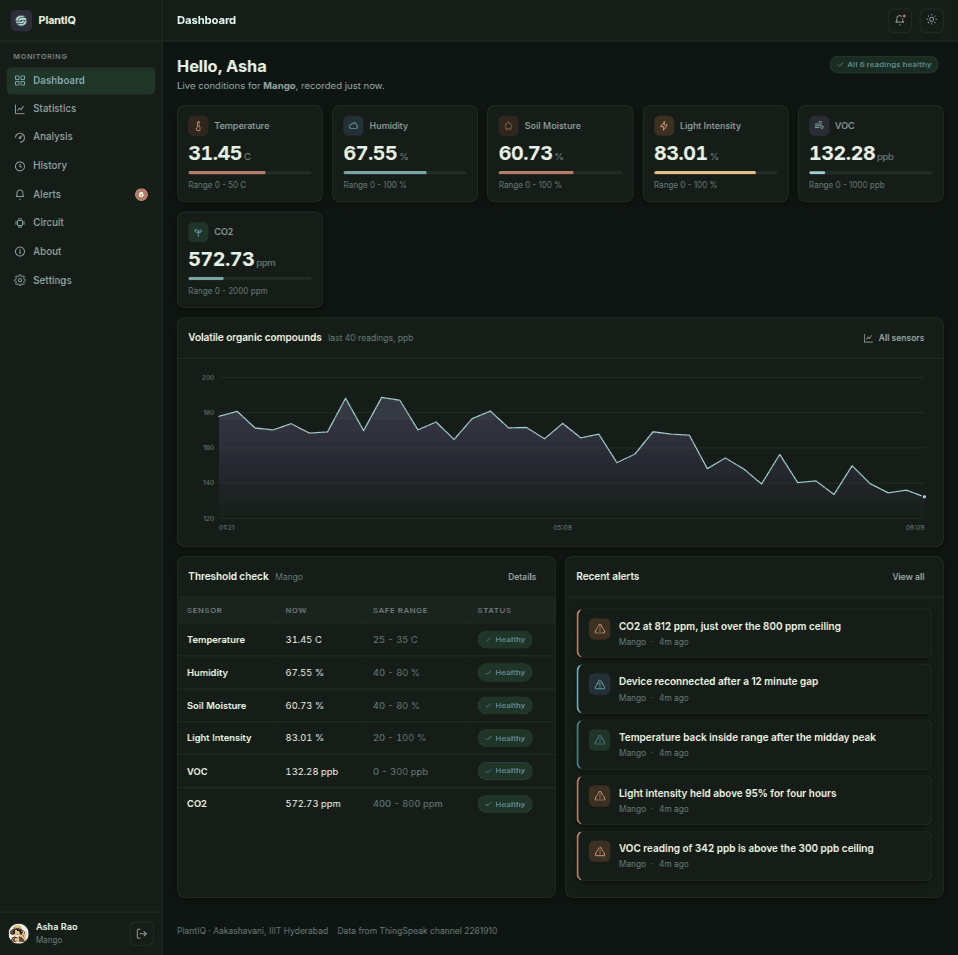
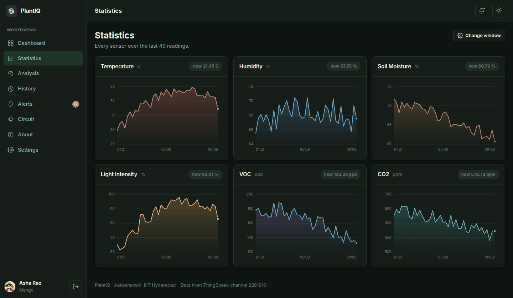
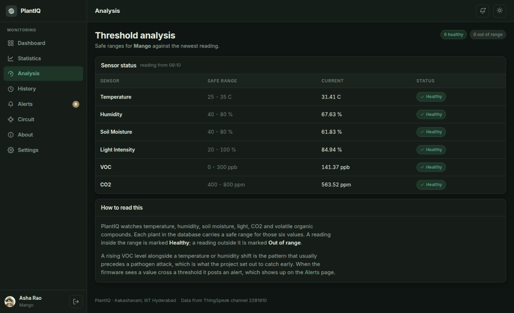
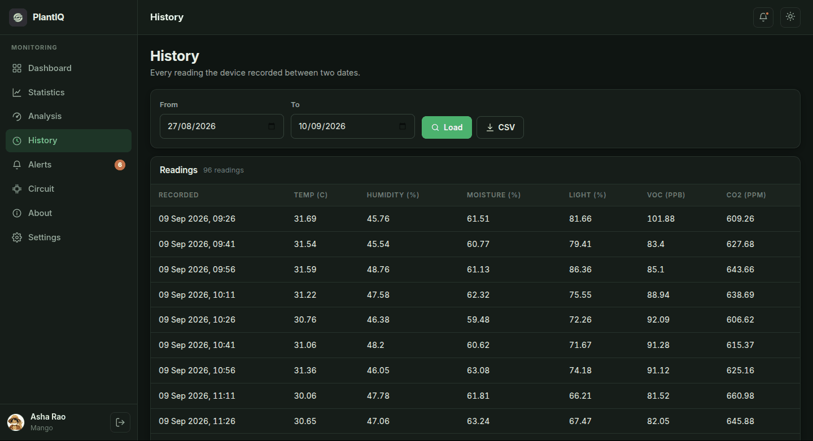
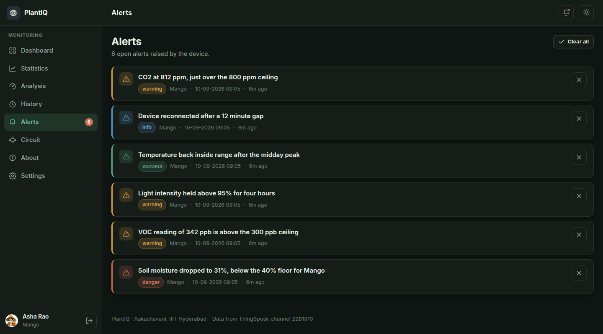
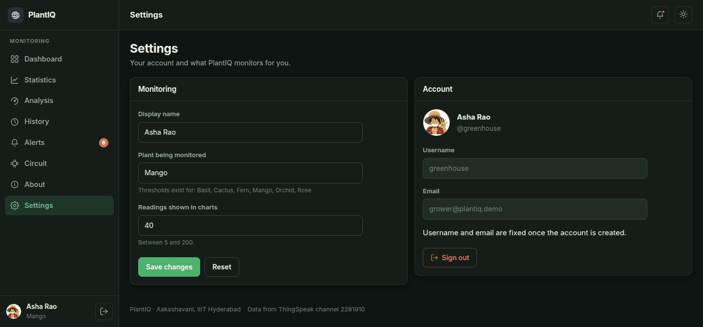
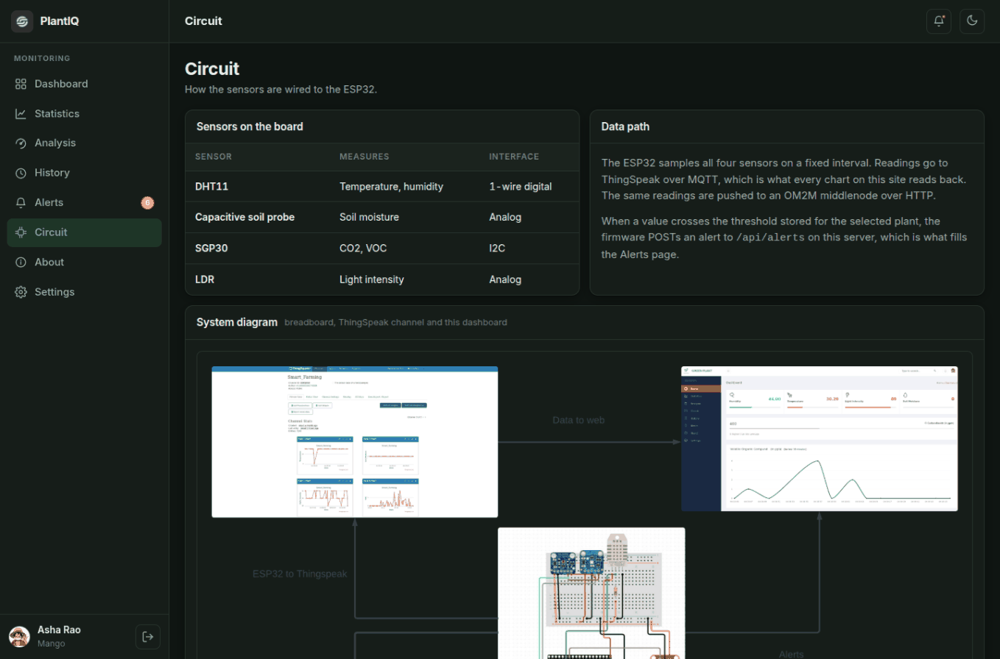
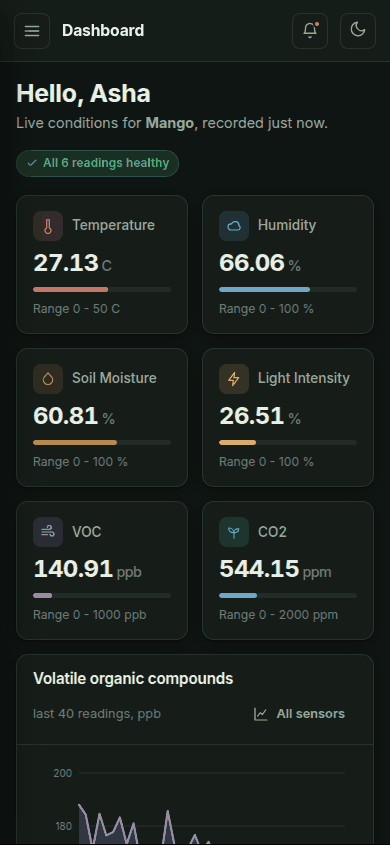
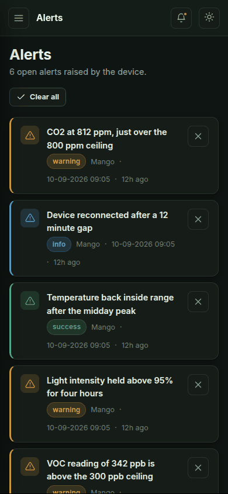
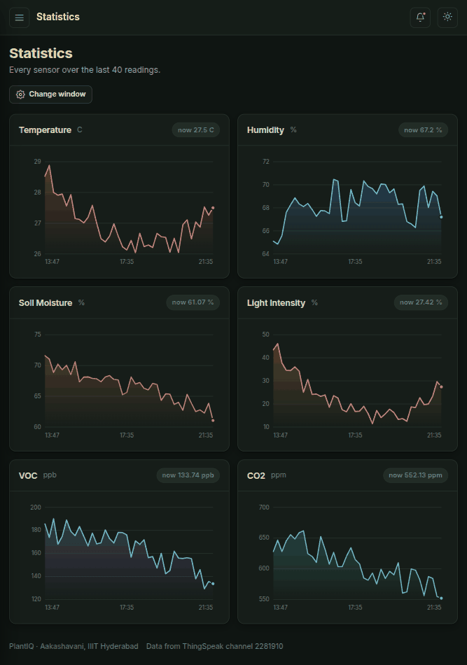

<div align="center">

<picture>
  <source media="(prefers-color-scheme: dark)" srcset="./docs/assets/adk_dev_logo_light.png">
  
</picture>

# PlantIQ

**A plant health monitor for an experimental farm. Six sensors on an ESP32 watch a plant's air, soil and light; PlantIQ reads them back, judges every value against the safe range for that species, and raises an alert the moment one drifts out.**


<br>


<br><br>

[](https://github.com/Dileepadari/PlantIQ/actions/workflows/ci.yml)

**[Developer documentation](./DEVDOC.md)** &middot; [Screenshots](#screenshots) &middot; [Features](#features)

<p><b>Dark mode</b> &middot; <a href="./README-light.md">View this page in light mode</a></p>

</div>

---

## Contents

- [Why this project matters](#why-this-project-matters)
- [Where it came from](#where-it-came-from)
- [Screenshots](#screenshots)
- [Responsive layout](#responsive-layout)
- [Features](#features)
- [What it measures](#what-it-measures)
- [Getting started](#getting-started)
- [Contributors](#contributors)
- [Contributing](#contributing)
- [License](#license)

---

## Why this project matters

A plant tells you it is in trouble long before it looks like it.

Under pathogen attack a plant changes the volatile organic compounds it releases
into the air, and it does that days before a leaf yellows or a stem wilts. By the
time a farmer can see the problem, the useful window has usually closed.

That is the whole argument for this project. A VOC sensor read **alongside**
temperature, humidity, soil moisture, light and CO2 catches the shift while there
is still something to do about it. Any one of those readings on its own is noise:
VOC rises when it is hot, moisture falls when it is windy. It is the combination,
judged against a range that belongs to *that species*, that means anything.

So PlantIQ is not a sensor dashboard that happens to show plants. It is a
threshold engine with a dashboard attached, and the thresholds are per-species
because 30C is a comfortable afternoon for a Mango and a slow death for a Fern.

## Where it came from

An IoT course project at IIIT Hyderabad, under Aakashavani, built by four people
around one breadboard.

The original was a single Flask file, a database committed straight into the
repository, and a dashboard that showed numbers without saying whether they were
good numbers. It worked, in the sense that readings arrived. What it could not do
was answer the only question that matters standing in a field: **is this plant
all right?**

Everything since has been in service of that one question. The per-species
threshold table came first, then the traffic-light status on every reading, then
alerts pushed from the firmware the instant a value crosses rather than whenever
somebody next opens the page. The rewrite into a package, the tests, and the
removal of that committed database came later, and are described honestly in
[not_for_you.md](./not_for_you.md).

## Screenshots

Real renders against a running instance, signed in through the app's own signup
form. This page shows **dark mode**; the same gallery in
light mode is at **[README-light.md](./README-light.md)**.

<table>
  <tr>
    <td width="33%" valign="top">
      
      <p align="center"><b>Dashboard</b><br><sub>Every sensor now, the VOC trend, the threshold table and open alerts.</sub></p>
    </td>
    <td width="33%" valign="top">
      
      <p align="center"><b>Statistics</b><br><sub>One chart per sensor across the window you pick.</sub></p>
    </td>
    <td width="33%" valign="top">
      
      <p align="center"><b>Analysis</b><br><sub>Each reading judged against the safe range for your plant.</sub></p>
    </td>
  </tr>
  <tr>
    <td width="33%" valign="top">
      
      <p align="center"><b>History</b><br><sub>Every reading between two dates, exportable as CSV.</sub></p>
    </td>
    <td width="33%" valign="top">
      
      <p align="center"><b>Alerts</b><br><sub>Threshold breaches the firmware reported, by severity.</sub></p>
    </td>
    <td width="33%" valign="top">
      
      <p align="center"><b>Settings</b><br><sub>Which plant is monitored, and how far the charts go back.</sub></p>
    </td>
  </tr>
</table>

<details>
<summary><b>Circuit</b></summary>
<br>

</details>

## Responsive layout

Each image is its own device viewport, not a crop of the desktop layout. The sidebar collapses
to a drawer, the metric grid reflows to two columns, and every table scrolls inside its own card
rather than pushing the page sideways.

<table>
  <tr>
    <td width="25%" valign="top">
      
      <p align="center"><sub><b>Dashboard</b><br>390 x 844</sub></p>
    </td>
    <td width="25%" valign="top">
      
      <p align="center"><sub><b>Alerts</b><br>390 x 844</sub></p>
    </td>
    <td width="50%" valign="top">
      
      <p align="center"><sub><b>Statistics</b><br>820 x 1180</sub></p>
    </td>
  </tr>
</table>

## Features

| | |
|---|---|
| [Live dashboard](#live-dashboard) | Every sensor's current value, judged, with the VOC trend |
| [Per-species thresholds](#per-species-thresholds) | Six safe ranges per plant, six plants shipped |
| [Threshold analysis](#threshold-analysis) | Every reading marked Healthy or Out of range |
| [Per-sensor charts](#per-sensor-charts) | One chart each, over a window you choose |
| [History and CSV export](#history-and-csv-export) | Every reading between two dates, downloadable |
| [Device alerts](#device-alerts) | The firmware pushes a breach; the site shows it |
| [Offline honesty](#offline-honesty) | A silent device is said to be silent, never faked |
| [Circuit reference](#circuit-reference) | What is wired where, and the path to the dashboard |
| [Accounts](#accounts) | Sign up, pick a plant, keep your own settings |
| [Light and dark](#light-and-dark) | Both, remembered, defaulting to the OS |

---

### Live dashboard

Every sensor as a tile with a bar showing where the reading sits in its range,
the VOC trend below, a threshold table on the left and the newest alerts on the
right. One glance answers the question the whole project exists for.

**Using it:** it is the page you land on. Tiles refresh on their own every 30
seconds, so it can be left open on a spare screen.

### Per-species thresholds

Six safe ranges per plant: temperature, humidity, soil moisture, light, VOC and
CO2. Mango, Cactus, Rose, Basil, Orchid and Fern ship with the app, in
`src/plantiq/data/plants.json`.

This is the part that turns readings into a judgement. A number without a range
is trivia.

**Using it:** pick your plant under **Settings**. To add a species, add an object
to `plants.json` with its six ranges and restart; `init_db()` tops up anything
missing without touching a threshold you have tuned yourself.

### Threshold analysis

The six readings against your plant's safe ranges, each marked **Healthy** or
**Out of range**, with a count of each at the top and an explanation of what the
combination means.

A missing reading is marked **unknown**, never healthy. A dead sensor must not
look like a well plant.

**Using it:** **Analysis** in the sidebar.

### Per-sensor charts

One chart per sensor across your chosen window, each with the current value
pinned in its header. Hover any point for the exact value and time.

**Using it:** **Statistics**. The window is the "readings shown in charts"
setting, between 5 and 200.

### History and CSV export

Pick two dates and load every reading the device recorded in between. Missing
sensor values render as `--` rather than zero, because zero is a reading and a
gap is not.

**Using it:** **History**, pick a range, press Load. **CSV** downloads exactly
what is on screen. If your range is empty, the page tells you the date of the
most recent reading on the channel instead of just showing nothing.

### Device alerts

The ESP32 does its own threshold comparison and POSTs to `/api/alerts` the moment
a value crosses, authenticated with a shared token. The site stores it, colours
it by severity, and counts what is still open in the sidebar.

An identical alert that is already open is not recorded twice, so a sensor
sitting just over a line does not bury everything else.

**Using it:** **Alerts**. Dismiss one at a time or clear the lot. To wire your own
device, set `PLANTIQ_DEVICE_TOKEN` on the server and `SECRET_DEVICE_TOKEN` in the
firmware's `secrets.h` to the same value.

### Offline honesty

If the channel is unreachable or the device has not reported recently, every page
says so and labels the numbers as the most recent on the channel rather than
current ones.

This is deliberate and it is the feature most worth keeping. A monitoring page
that quietly shows stale numbers is worse than one that shows none, because it
answers the question wrongly rather than declining to answer.

**Using it:** nothing to do. The pages render either way; they never 500 because
an API was slow.

### Circuit reference

What each sensor is, how it measures, how it connects to the ESP32, and the
system diagram from breadboard through ThingSpeak to this dashboard.

**Using it:** **Circuit**.

### Accounts

Sign up with a username, name, email and password, choose the plant you are
growing, and that choice drives every judgement the site makes for you.

Passwords are hashed with Werkzeug's scrypt. Any account still holding a
clear-text password from the old database is re-hashed in place the first time it
signs in successfully.

**Using it:** **Create an account** on the login page. Four fields, no
confirmation step.

### Light and dark

Both ship, both are written and checked rather than one being derived from the
other. The toggle is in the top bar and your choice is remembered in that
browser; with no choice made, PlantIQ follows the operating system.

## What it measures

| Sensor | Reads | How it works |
|---|---|---|
| DHT11 | Temperature, humidity | A humidity-sensitive polymer and a thermistor, both read as resistance changes |
| Capacitive probe | Soil moisture | Dielectric permittivity of soil rises with water content |
| SGP30 | CO2, VOC | A metal-oxide film changes conductivity in the presence of the target gases |
| LDR | Light intensity | Photoconductivity: resistance falls as incident light rises |

Readings go to a ThingSpeak channel over MQTT, and the same values are pushed to
an OM2M middlenode over HTTP. Every chart on the site reads the ThingSpeak
channel back.

## Getting started

Requires Python 3.10 or newer.

```sh
git clone git@github.com:Dileepadari/PlantIQ.git
cd PlantIQ
python -m venv .venv && . .venv/bin/activate
pip install -r requirements.txt

cp .env.example .env      # then fill it in
python src/wsgi.py        # http://127.0.0.1:5000
```

There is no database in the repository and no seeding step. The first start
creates the schema and loads the plant profiles, and the first account you
register is yours.

To point it at live hardware, set `PLANTIQ_TS_CHANNEL` and `PLANTIQ_TS_READ_KEY`
for your own ThingSpeak channel, and `PLANTIQ_DEVICE_TOKEN` to match the
firmware. [DEVDOC.md](./DEVDOC.md#environment) lists every variable.

The firmware is `Arduino/ESW_Project.ino`. Copy `Arduino/secrets.example.h` to
`Arduino/secrets.h` and fill it in; `secrets.h` is gitignored and must stay that
way.

### Tests

```sh
pip install -r requirements-dev.txt
pytest -q      # 55 tests, no network
ruff check src tests
```

## Contributors

<table>
  <tr>
    <td align="center">
      <a href="https://github.com/Dileepadari">
        
        <br><sub><b>Adari Dileep Kumar</b></sub>
      </a>
      <br><sub>Web application, API, firmware integration</sub>
    </td>
    <td align="center">
      <a href="https://github.com/bharath-gajawada">
        
        <br><sub><b>Gajawada Bharath</b></sub>
      </a>
      <br><sub>Sensors and circuit</sub>
    </td>
    <td align="center">
      <a href="https://github.com/kryptonblade">
        
        <br><sub><b>Chaganti Venkata Karthikeya</b></sub>
      </a>
      <br><sub>OM2M layer</sub>
    </td>
    <td align="center">
      <a href="https://github.com/nagarevanth">
        
        <br><sub><b>Sallepalle Naga Revanth Reddy</b></sub>
      </a>
      <br><sub>Firmware and data pipeline</sub>
    </td>
  </tr>
</table>

Built at IIIT Hyderabad under Aakashavani. Presentation decks are in
[`ppts/`](./ppts); the OM2M middlenode is vendored as a submodule in `OM2M_ESW/`.

## Contributing

Fork, branch off `main`, open a pull request.

CI runs three jobs and all must pass:

- **Lint and test** on Python 3.10 and 3.12: `ruff check` and `pytest`.
- **No database file is tracked**: fails if any `.db`, `.sqlite` or `.sqlite3`
  reappears, or if a credential literal shows up in the firmware sketch. Both
  guards exist because both things happened. See
  [not_for_you.md](./not_for_you.md).
- **The light README matches its source**: `README-light.md` is generated.

If you change `README.md`, regenerate its twin:

```sh
node scripts/build-light-readme.mjs
```

## License

MIT. See [LICENSE](./LICENSE).
